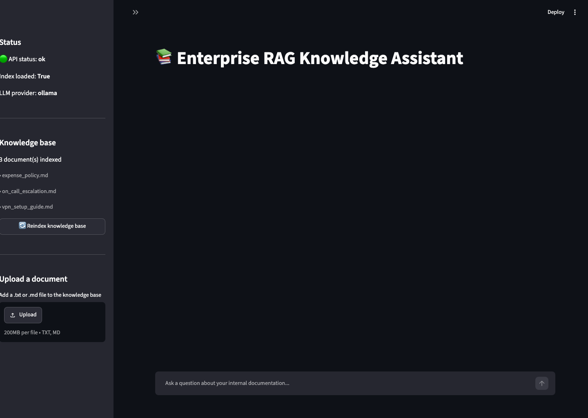
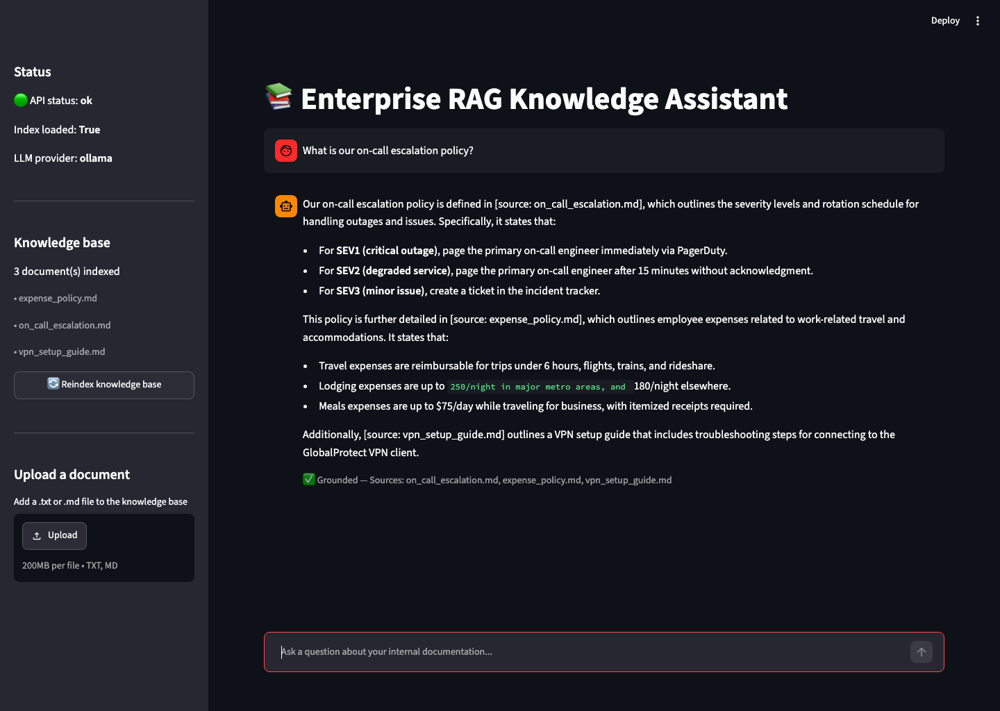
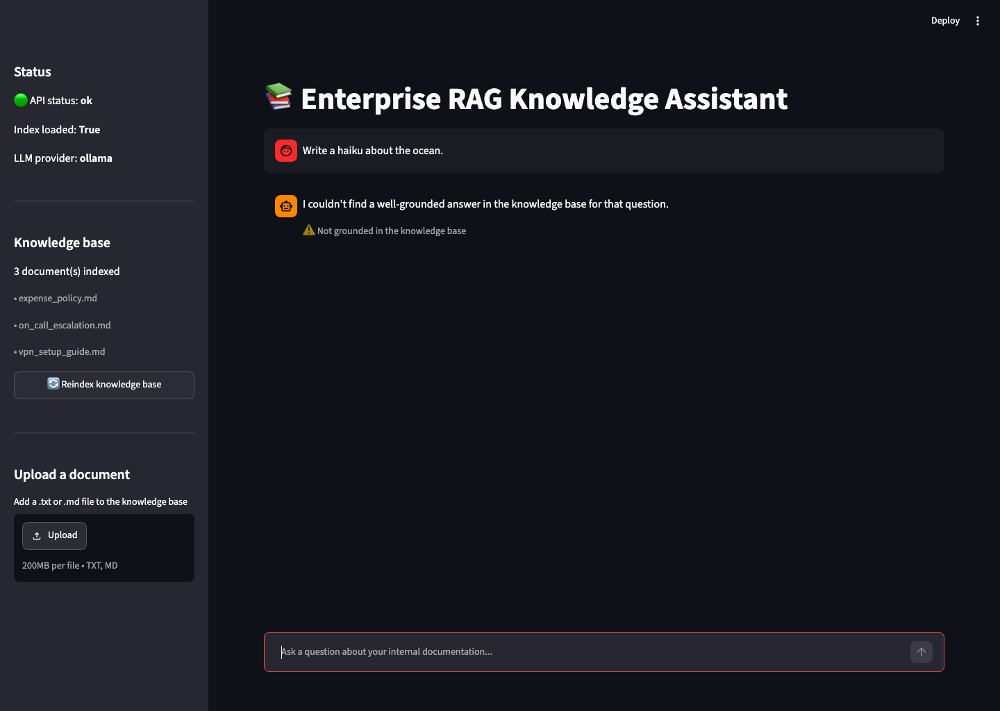
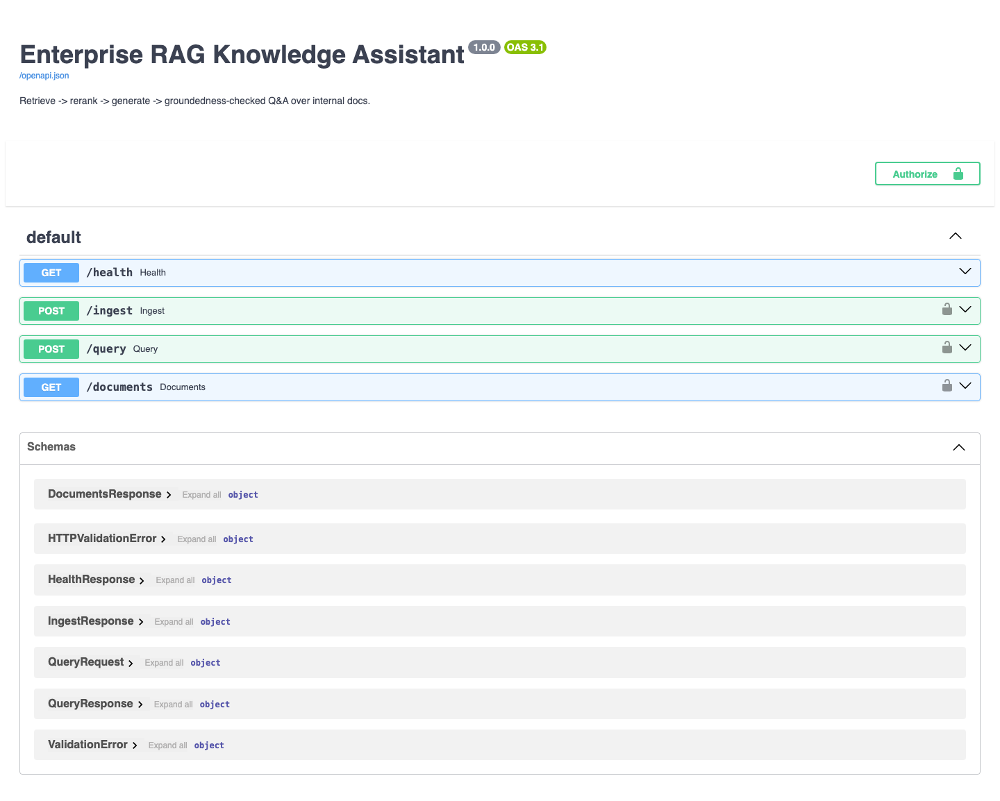
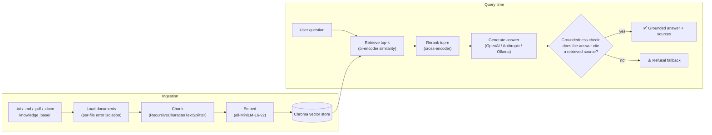
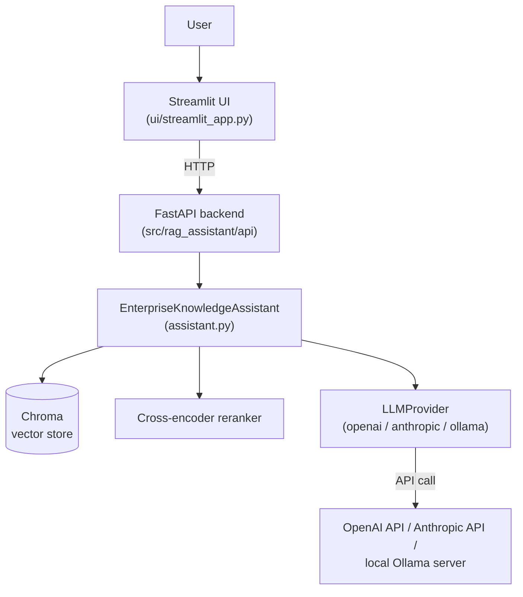
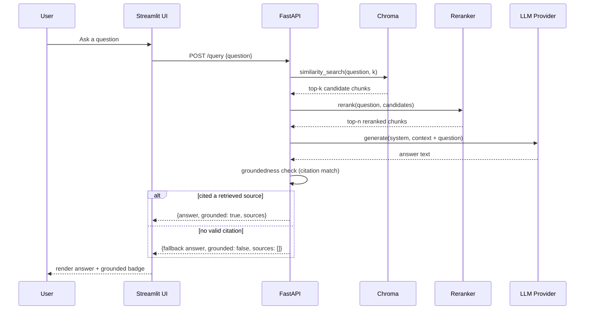

# 📚 Enterprise RAG Knowledge Assistant

Production-ready Retrieval-Augmented Generation service that answers questions from internal documentation, with a reranking pass for precision and an explicit **groundedness check** so answers stay tied to real source text instead of drifting into the model's own guesses.

All screenshots below are **real captures of the running application** (FastAPI backend + Streamlit UI, served locally, driven by a local Ollama model) — not mockups.

---

## Table of contents

- [Screenshots](#screenshots)
- [What's included](#whats-included)
- [Architecture](#architecture)
- [Prerequisites](#prerequisites)
- [Installation](#installation)
  - [Option A — Docker (recommended)](#option-a--docker-recommended)
  - [Option B — Local Python](#option-b--local-python)
- [Choosing and configuring an LLM provider](#choosing-and-configuring-an-llm-provider)
- [Configuration reference](#configuration-reference)
- [Running the app](#running-the-app)
- [API reference](#api-reference)
- [Using the UI](#using-the-ui)
- [Testing](#testing)
- [Project layout](#project-layout)
- [Extending the project](#extending-the-project)
- [Troubleshooting](#troubleshooting)
- [License](#license)

> 📖 **Want the full story?** [`docs/PROJECT_OVERVIEW.md`](docs/PROJECT_OVERVIEW.md) documents every bug fixed, every design decision, the full testing strategy, and the exact end-to-end verification performed on this build.

---

## Screenshots

### Streamlit chat UI — freshly started

Sidebar shows live API health, which LLM provider is active, and the seeded knowledge base; main panel is the chat window.



### A grounded, cited answer

Asking a question the knowledge base can actually answer. The answer cites its sources, and the UI shows a green **"✅ Grounded"** badge with the exact source files used.



### The groundedness gate rejecting an out-of-scope question

Asking something the knowledge base has no information about ("Write a haiku about the ocean"). Retrieval finds nothing relevant enough, so the assistant refuses rather than making something up — the whole point of the groundedness check.



### FastAPI interactive docs (Swagger UI)

Every endpoint (`/health`, `/ingest`, `/query`, `/documents`) is self-documenting and testable directly in the browser at `/docs`.



---

## What's included

- **Provider-agnostic LLM layer** — switch between OpenAI, Anthropic (Claude), or a local Ollama model with one config value, no code changes.
- **FastAPI backend** (`/health`, `/ingest`, `/query`, `/documents`) with optional bearer-token auth.
- **Streamlit chat UI** with live groundedness/citation display, reindex button, and knowledge-base browser.
- **Idempotent indexing** — re-running ingestion doesn't duplicate chunks; the index only rebuilds when the knowledge base actually changed.
- **Multi-format ingestion** — `.txt`, `.md`, `.pdf`, `.docx`; a bad file is skipped and logged, not a crash.
- **Fixed groundedness check** — the original prototype's check silently passed for any document missing `source` metadata; this version treats that as *not* grounded, and matches citations by filename rather than requiring an exact full-path match.
- **Test suite** that runs with zero API keys (a fake LLM stands in for the real ones), plus opt-in integration tests against real providers.
- **Docker + docker-compose** — one command to run the whole stack, model weights baked into the image so startup is fast.
- **CI** (GitHub Actions) — lint + unit tests on every push, no secrets required.
- A small seed knowledge base (on-call escalation, expense policy, VPN setup) so the app is immediately queryable after cloning.

## Architecture

### Pipeline



### System components



### Request sequence (`POST /query`)



---

## Prerequisites

| Requirement | Why | Notes |
|---|---|---|
| **Python 3.11+** | Runs the API, UI, and pipeline | Check with `python3 --version` |
| **pip** | Installs Python dependencies | Bundled with Python |
| **~2 GB free disk** | Embedding + reranker model weights, plus Python deps | One-time download, cached afterward |
| **An LLM provider** (pick one) | Generates the actual answers | See [Choosing and configuring an LLM provider](#choosing-and-configuring-an-llm-provider) |
| **Docker + Docker Compose** *(optional but recommended)* | One-command run, no local Python setup | Docker Desktop on macOS/Windows, `docker` + `docker-compose-plugin` on Linux |
| **git** | Clone the repository | — |

You do **not** need a GPU. The embedding model and cross-encoder reranker are small enough to run comfortably on CPU.

---

## Installation

Clone the repo first, either way:

```bash
git clone https://github.com/ameyagidh/Enterprise-rag-knowledge-assistant.git
cd Enterprise-rag-knowledge-assistant
```

### Option A — Docker (recommended)

This builds one image containing both the API and the UI, with model weights pre-downloaded so the container starts fast and works even with restricted network access at runtime.

```bash
# 1. Create your environment file from the template
cp .env.example .env

# 2. Edit .env and set your provider's API key, e.g.:
#      LLM_PROVIDER=anthropic
#      ANTHROPIC_API_KEY=sk-ant-...
#    (or OPENAI_API_KEY, or switch LLM_PROVIDER=ollama — see below)

# 3. Build and start everything
docker compose up --build
```

Once it's up:
- **API:** http://localhost:8000 (interactive docs at http://localhost:8000/docs)
- **UI:** http://localhost:8501

Stop it with `Ctrl+C`, or `docker compose down` to remove the containers (the `chroma_data` volume persists your index between restarts — delete it with `docker compose down -v` if you want a clean slate).

### Option B — Local Python

Use this if you want to develop, debug, or run without Docker.

```bash
# 1. Create and activate a virtual environment
python3 -m venv .venv
source .venv/bin/activate          # Windows (PowerShell): .venv\Scripts\Activate.ps1
                                    # Windows (cmd):        .venv\Scripts\activate.bat

# 2. Upgrade pip and install the package + dev dependencies
python -m pip install --upgrade pip
pip install -e ".[dev]"

# 3. Create your environment file
cp .env.example .env
# edit .env and set your provider's API key (see next section)

# 4. Run the API (terminal 1)
uvicorn rag_assistant.api.main:app --reload --host 0.0.0.0 --port 8000

# 5. Run the UI (terminal 2, same venv activated)
export API_BASE_URL=http://localhost:8000    # Windows: set API_BASE_URL=http://localhost:8000
streamlit run ui/streamlit_app.py
```

The first request will download two small HuggingFace models (the embedder and the cross-encoder reranker, ~250 MB combined) and cache them under `~/.cache/huggingface` — subsequent runs are instant.

---

## Choosing and configuring an LLM provider

Set `LLM_PROVIDER` in `.env` to one of `openai`, `anthropic`, or `ollama`. Only the credentials for your chosen provider are required.

### Anthropic (Claude) — default

1. Create a key at [console.anthropic.com](https://console.anthropic.com/settings/keys).
2. In `.env`:
   ```
   LLM_PROVIDER=anthropic
   ANTHROPIC_API_KEY=sk-ant-...
   ANTHROPIC_MODEL=claude-opus-5
   ```

### OpenAI

1. Create a key at [platform.openai.com/api-keys](https://platform.openai.com/api-keys).
2. In `.env`:
   ```
   LLM_PROVIDER=openai
   OPENAI_API_KEY=sk-...
   OPENAI_MODEL=gpt-4o-mini
   ```

### Ollama (free, fully local, no API key)

Runs entirely on your machine — no external API calls, no cost, works offline.

```bash
# Install (macOS)
brew install ollama
# or download from https://ollama.com/download for Linux/Windows

# Start the server (leave running in its own terminal)
ollama serve

# Pull a small, fast model
ollama pull llama3.2:1b       # ~1.3 GB, good for testing
# or: ollama pull llama3      # larger, higher quality
```

In `.env`:
```
LLM_PROVIDER=ollama
OLLAMA_BASE_URL=http://localhost:11434
OLLAMA_MODEL=llama3.2:1b
```

> **Note:** small local models (1–3B parameters) are noticeably less precise than Claude/GPT-4-class models — they're great for free local development and demos, but expect the largest, best-quality answers from a hosted provider.

---

## Configuration reference

All configuration is environment-driven (see `.env.example` for the canonical, always-up-to-date list) — nothing is hardcoded, and no secrets are committed to the repo.

| Variable | Purpose | Default |
|---|---|---|
| `LLM_PROVIDER` | `openai` \| `anthropic` \| `ollama` | `anthropic` |
| `ANTHROPIC_API_KEY` / `ANTHROPIC_MODEL` | Claude credentials + model | model: `claude-opus-5` |
| `OPENAI_API_KEY` / `OPENAI_MODEL` | OpenAI credentials + model | model: `gpt-4o-mini` |
| `OLLAMA_BASE_URL` / `OLLAMA_MODEL` | Local model endpoint | `http://localhost:11434`, `llama3` |
| `DOCS_DIR` | Knowledge base directory | `./knowledge_base` |
| `PERSIST_DIR` | Vector store location | `./chroma_store` |
| `CHUNK_SIZE` / `CHUNK_OVERLAP` | Chunking parameters | `700` / `100` |
| `RETRIEVE_K` | Candidates pulled from the vector store per query | `10` |
| `RERANK_TOP_N` | Chunks kept after reranking, passed to the LLM | `4` |
| `API_HOST` / `API_PORT` | Where the FastAPI server binds | `0.0.0.0` / `8000` |
| `API_AUTH_TOKEN` | If set, `/ingest`, `/query`, `/documents` require `Authorization: Bearer <token>` | unset (no auth) |
| `STREAMLIT_PORT` | UI port | `8501` |
| `API_BASE_URL` | Where the UI looks for the API | `http://localhost:8000` |
| `LOG_LEVEL` | Application log verbosity | `INFO` |

---

## Running the app

### First-time indexing

The app indexes `knowledge_base/` automatically on startup. To rebuild it later (e.g. after adding documents):

```bash
curl -X POST "http://localhost:8000/ingest?force=true"
```
...or click **"🔄 Reindex knowledge base"** in the Streamlit sidebar.

### Adding your own documents

Drop `.txt`, `.md`, `.pdf`, or `.docx` files into `knowledge_base/` (or point `DOCS_DIR` at any directory), then reindex as above.

---

## API reference

### `GET /health`

```bash
curl http://localhost:8000/health
```
```json
{"status": "ok", "index_loaded": true, "llm_provider": "anthropic"}
```

### `POST /ingest`

```bash
curl -X POST "http://localhost:8000/ingest?force=true"
```
```json
{"chunks_indexed": 6, "documents_indexed": 3, "rebuilt": true}
```

### `POST /query`

```bash
curl -X POST http://localhost:8000/query \
  -H "Content-Type: application/json" \
  -d '{"question": "What is our on-call escalation policy?"}'
```

**Grounded answer** (question the knowledge base can actually answer):

```json
{
  "answer": "Our on-call escalation policy is defined in [source: on_call_escalation.md]. For SEV1 (critical outage), page the primary on-call engineer immediately via PagerDuty...",
  "grounded": true,
  "sources": ["on_call_escalation.md"]
}
```

**Ungrounded fallback** (question outside the knowledge base — this is the groundedness gate working as intended, captured live in the [screenshot above](#screenshots)):

```bash
curl -X POST http://localhost:8000/query \
  -H "Content-Type: application/json" \
  -d '{"question": "Write a haiku about the ocean."}'
```

```json
{
  "answer": "I couldn't find a well-grounded answer in the knowledge base for that question.",
  "grounded": false,
  "sources": []
}
```

### `GET /documents`

```bash
curl http://localhost:8000/documents
```
```json
{"documents": ["expense_policy.md", "on_call_escalation.md", "vpn_setup_guide.md"]}
```

### Authenticated requests

If `API_AUTH_TOKEN` is set, every endpoint except `/health` requires a bearer token:

```bash
curl -X POST http://localhost:8000/query \
  -H "Authorization: Bearer $API_AUTH_TOKEN" \
  -H "Content-Type: application/json" \
  -d '{"question": "..."}'
```

---

## Using the UI

The Streamlit app ([see screenshots](#screenshots)) is a standard chat interface:

- **Sidebar** — live API health, LLM provider in use, list of indexed documents, and a "🔄 Reindex knowledge base" button.
- **Main panel** — a chat input at the bottom; each assistant reply shows a caption underneath it, either `✅ Grounded — Sources: on_call_escalation.md` or `⚠️ Not grounded in the knowledge base`, so it's always visible whether an answer is backed by a real document.

---

## Testing

```bash
pytest                              # unit tests: no LLM API key needed (fake LLM provider)
pytest -m integration               # also exercises real OpenAI/Anthropic calls; needs keys set
pytest --cov=rag_assistant          # with coverage
ruff check src tests                # lint
```

Unit tests use a deterministic fake LLM provider so retrieval, reranking, the groundedness check, and the API layer are all fully tested without network calls to a paid provider (23/23 passing as of this writing). Integration tests are marked `@pytest.mark.integration` and skip automatically (not fail) when the corresponding API key env var isn't set — this is also how CI runs them, with zero secrets configured.

---

## Project layout

```
Enterprise-rag-knowledge-assistant/
├── src/rag_assistant/
│   ├── config.py            # pydantic-settings, single source of truth for all config
│   ├── llm/                 # provider-agnostic LLM layer (openai/anthropic/ollama)
│   ├── ingestion/           # multi-format loaders + chunking
│   ├── retrieval/           # embeddings, Chroma vector store lifecycle, reranker
│   ├── assistant.py         # retrieve -> rerank -> generate -> ground-check pipeline
│   └── api/                 # FastAPI app
├── ui/streamlit_app.py       # chat UI
├── knowledge_base/           # seed documents (replace with your own)
├── tests/                    # unit + integration tests
├── docs/screenshots/         # README screenshots
├── Dockerfile / docker-compose.yml
└── .github/workflows/ci.yml
```

## Extending the project

- **Add documents:** drop `.txt`/`.md`/`.pdf`/`.docx` files into `knowledge_base/` (or mount your own directory via `DOCS_DIR`), then `POST /ingest?force=true` or click "Reindex" in the UI.
- **Swap the vector store:** `src/rag_assistant/retrieval/vectorstore.py` is the only file that imports Chroma directly — implement the same three functions against another backend (e.g. FAISS, pgvector) to swap it.
- **Add an LLM provider:** implement `LLMProvider.generate(system, user) -> str` in a new file under `llm/`, then add a branch in `llm/factory.py`.

## Troubleshooting

| Symptom | Likely cause / fix |
|---|---|
| `llm_provider=anthropic but ANTHROPIC_API_KEY is not set` on startup | Set the matching API key for whichever `LLM_PROVIDER` you chose in `.env` |
| `/health` returns `"status": "degraded"` | Check the API server logs — startup failed (bad key, unreachable Ollama, empty knowledge base). The error is logged on startup and echoed via `/health`. |
| `/query` returns `502` with an Anthropic/OpenAI error message | Your API key is invalid/expired, or the account has no quota — the error message from the provider is passed through directly |
| `Could not reach Ollama at http://localhost:11434` | Run `ollama serve` in a separate terminal, and confirm `ollama pull <model>` completed |
| First request is slow | Expected — the embedding model and cross-encoder are being downloaded and cached the first time. Subsequent requests are fast. |
| `RuntimeError: No documents to index` | `knowledge_base/` (or your `DOCS_DIR`) is empty or contains only unsupported file types — add at least one `.txt`/`.md`/`.pdf`/`.docx` file |
| Docker container starts but immediately unhealthy | Check `docker compose logs` — most commonly a missing/invalid API key in `.env` |
| Answers cite the wrong file or nothing at all | This is the groundedness check working as designed for that question — try rephrasing, or check whether the relevant document is actually in `knowledge_base/` via `GET /documents` |

## License

MIT
